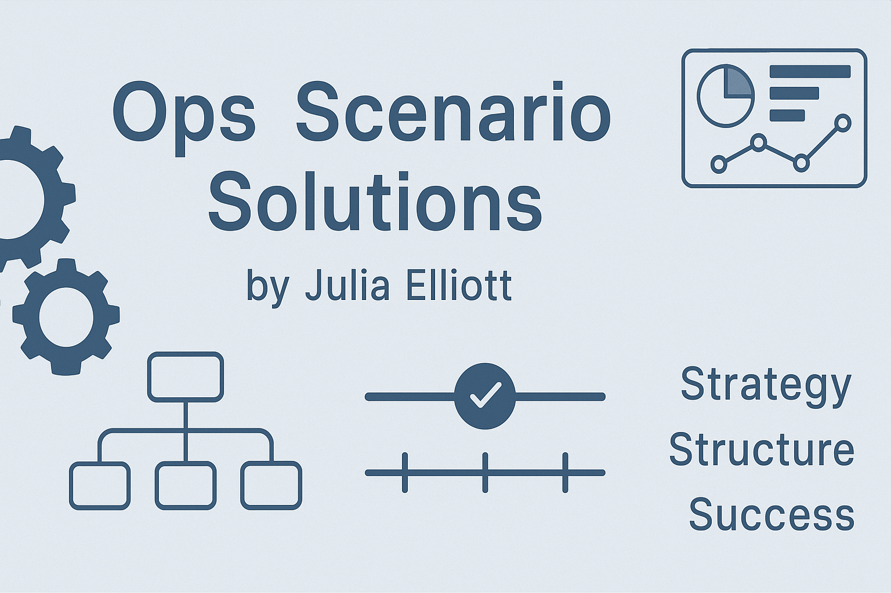

# Ops-Scenario-Solutions

Welcome to my repository of strategic operations scenarios and professional responses.

This collection showcases:
- Case-based thinking
- Problem-solving under constraints
- Real-world-ready operational playbooks

> ⚠️ These are **conceptual deliverables** based on hypothetical scenarios and should not be reused for commercial or organizational gain without consent.
> 

## Why This Repo?
These were originally completed as part of a professional assessment exercise. Rather than let them sit idle, I'm sharing them to demonstrate my analytical skills, operations knowledge, and practical documentation abilities.

---

## Scenarios Included

- [📄 Scenario 1: Manufacturing Bottleneck Analysis](./Scenario-1_Manufacturing-Bottleneck.pdf)
- [📄 Scenario 2: Legacy ERP Stabilization](./Scenario-2_Legacy-ERP-Stabilization.pdf)
- [📄 Scenario 3: Global SOP Program Build-Out](./Scenario-3_Global-SOP-Program.pdf)

---

## Scenario Source

The three scenarios showcased in this repository were provided as part of a professional assessment task. The original scenario prompts document is included in this repository for transparency.

---

# AI Collaboration Disclosure

These scenario responses were developed with the assistance of AI (ChatGPT by OpenAI) as part of an iterative brainstorming, editing, and polishing process. All final decisions, content direction, and submissions were reviewed and approved by me.

This collaboration reflects my ability to leverage modern tools ethically and effectively to produce high-quality, well-reasoned deliverables.

> ⚠️ These documents are for educational, demonstrative, and portfolio purposes only. They do not reflect the internal materials or strategies of any company or employer.

---

## License
This work is released under a [Creative Commons Attribution-NonCommercial 4.0 International License](https://creativecommons.org/licenses/by-nc/4.0/).
